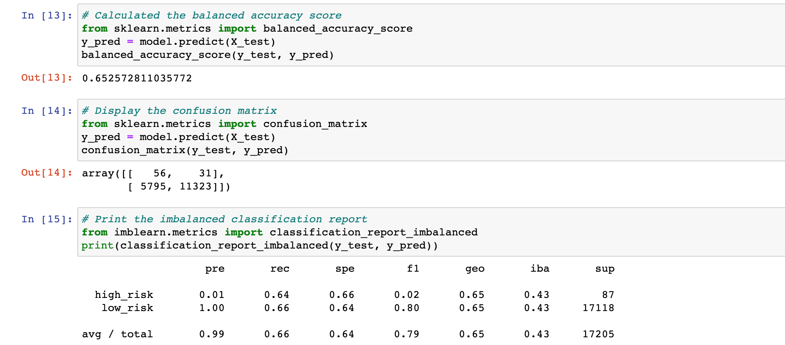
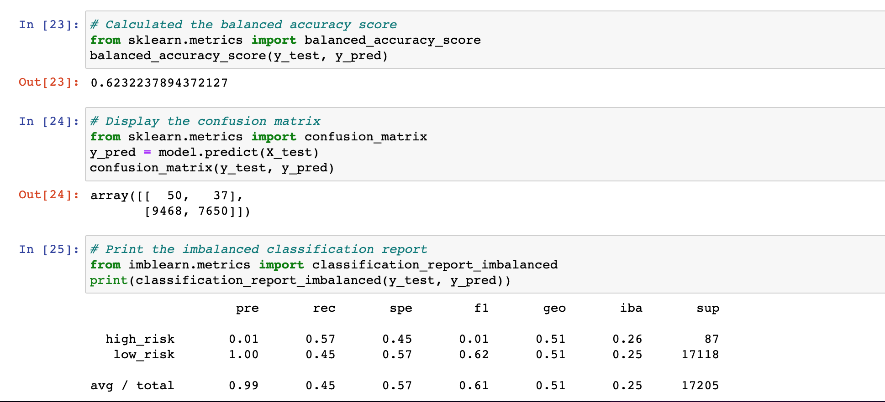

# Credit_Risk_Analysis

## Overview of the analysis:
In this project we use machine learning environment to predict credit risk. Because we use thestatistical algorithms to performs tasks like learning fromdata patterns and making predictions. We use 6 different machine learning models to predict credit worthiness even how to evaluate credit risk and banker can give a better recommendation on personal loan.
## Results: 
6 different machine learning models:

In Naive Random Oversampling model has accurarcy score is 65.26%, recall in 64% on high risk and 66% on low risk.Since the sensitivity is 1%.

In Smote oversampling model has accurarcy score is 62.32%, from the recall relate 59% on high rish and  66% on low risk and the sensitivity is 1%.

In undersampling - cluster centroids model has accurarcy score is 62.332%, from the recall relate 57% on high rish and 45% on low risk and the sensitivity is 1%.

In Combination (Over and Under) Sampling model has accurarcy score is 51.08%, from the recall relate 71% on high rish and 59% on low risk and the sensitivity is 1%.

In Balanced Random Forest Classifier model has accurarcy score is 78.78%, from the recall relate 67% on high rish and 91% on low risk and the sensitivity is 4%.

In Easy Ensemble AdaBoost Classifier model has accurarcy score is 92.54%, from the recall relate 91% on high rish and 94% on low risk and the sensitivity is 7%.

## Summary: 
According to different kind of machine learning models and variability on the prediction that are significate to explore which option is the best way to help match with the business for anaylzing the data that they have.
